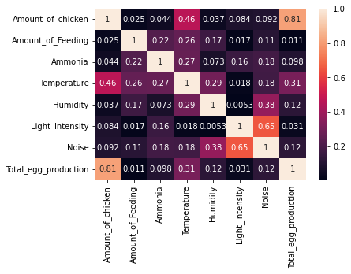
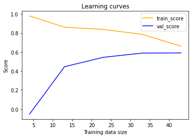

# Eggcellent Environment: Predicting Egg Production in Poultry

## Project Purpose and Description
"Eggcellent Environment" is a data science project aimed at predicting how egg production in poultry is affected by various environmental factors. The goal is to identify the key factors that influence egg production and build a predictive model to understand their impact.

## Dataset Used
The dataset used in this project was sourced from [Kaggle](https://www.kaggle.com/datasets/niharika41298/egg-production-dataset-state-wise-india) and contains relevant information about egg production and its associated environmental variables.

## Primary Goals
The primary objectives of the project are:
1. Analyze the dataset and perform Exploratory Data Analysis (EDA) to gain insights into the relationships between egg production and environmental factors.
2. Build a predictive model using Ridge regression to estimate egg production based on environmental inputs.
3. Develop a Streamlit web application to showcase the model's predictions and insights.

## Tools and Technology Used
The project was implemented using Python, and the following libraries were instrumental:
- Pandas: Data manipulation and analysis.
- Matplotlib and Seaborn: Data visualization and plotting.
- Scikit-Learn: Machine learning models and evaluation.
- Streamlit: Creating interactive web applications.
- NumPy: Fundamental library for numerical computing in Python, used for efficient array operations and mathematical functions.
- Joblib: Library for efficient serialization and deserialization of Python objects, particularly useful for saving and loading large numerical arrays in machine learning workflows.

## Project Structure
The project is organized into three main sections:
1. **Exploratory Data Analysis (EDA):** In this phase, the dataset was explored, visualized, and preprocessed to identify patterns and relationships between egg production and environmental factors.

2. **Model Building:** The data was preprocessed using the IsolationForest to remove outliers, and the RobustScaler was applied to reduce the impact of outliers on the data. The selected model for prediction is the Ridge regression, given the limited number of input data. The best L2 regularization coefficient was found using the GridSearch algorithm to optimize model performance.

3. **Streamlit App:** To make the results accessible and user-friendly, a Streamlit web application was created. Users can interact with the app to input environmental variables and get real-time predictions of egg production.

## Key Steps and Methodology
1. Data Preprocessing: Outliers were removed using IsolationForest, and data scaling was performed with RobustScaler to improve model performance.

2. Model Selection: Ridge regression was chosen as the predictive model due to the limited input data and the need for regularization.

3. Hyperparameter Tuning: The optimal L2 regularization coefficient was determined using GridSearch, fine-tuning the model for better accuracy.

## Results and Findings
The predictive model achieved an R-squared (R2) score of 0.67, indicating that around 67% of the variability in egg production can be explained by the environmental factors.

## Future Enhancements
While the project has achieved its primary goals, there are several avenues for future enhancements:
- **Data Expansion:** Collecting more data to increase the size and diversity of the dataset may improve the model's performance.
- **Feature Engineering:** Exploring additional environmental features or creating new ones based on domain knowledge could potentially enhance the predictive power of the model.
- **Different Algorithms:** Trying other regression algorithms or advanced machine learning techniques may lead to better predictions and insights.

Overall, "Eggcellent Environment" provides valuable insights into how environmental factors influence egg production and serves as a foundation for future developments in poultry farming research and optimization.
